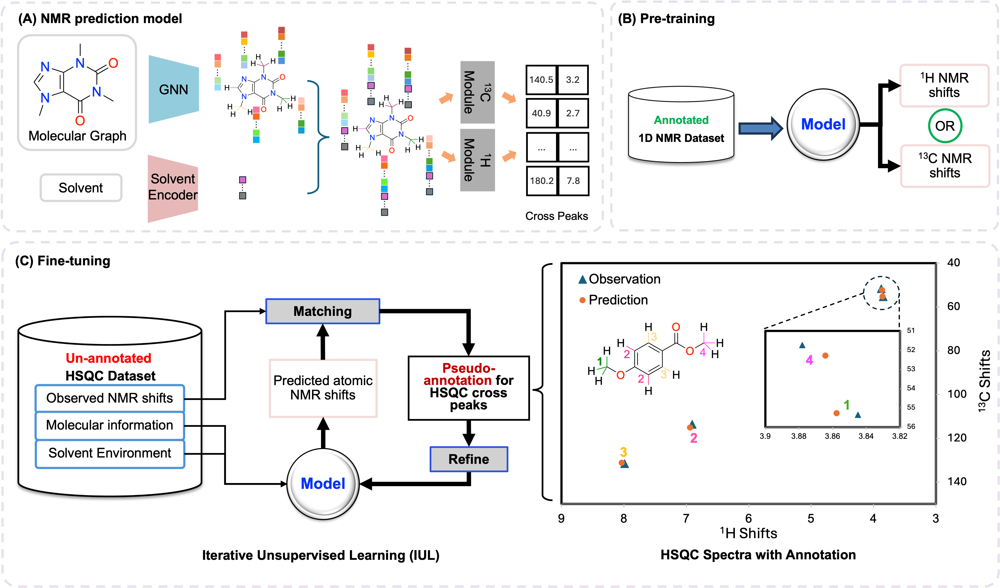
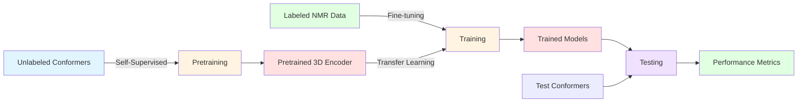

# 3D-conformers-enhanced-machine-learning-prediction-on-NMR-spectroscopy
# TransPeakNet
Official code and data of paper: [TransPeakNet: Solvent-Aware 2D NMR Prediction via Multi-Task Pre-Training and Unsupervised Learning](https://www.nature.com/articles/s42004-025-01455-9)

This article is licensed under a Creative Commons Attribution-NonCommercial-NoDerivatives 4.0 International License, which permits any non-commercial use, sharing, distribution and reproduction in any medium or format, as long as you give appropriate credit to the original author(s) and the source, provide a link to the Creative Commons licence, and indicate if you modified the licensed material.

The full dataset is available upon request. The test dataset is available here: https://drive.google.com/drive/folders/1wQxk7mnIwi5aAGaF34_hk7xo6IeEh-IE?usp=drive_link




## Requirements and Installation
### 1. Create Virtual Environment
```
conda create -n nmr python=3.9 
conda activate nmr
```

### 2. Install dependencies
```
pip install torch==1.13.1+cu117 torchvision==0.14.1+cu117 torchaudio==0.13.1 --extra-index-url https://download.pytorch.org/whl/cu117
pip install torch-geometric==1.6.3 torch-sparse==0.6.9 torch-scatter==2.0.7 -f https://data.pytorch.org/whl/torch_stable.html
pip install pytorch_lightning 
pip install pandas 
pip install matplotlib
pip install numpy
pip intall pickle5
conda install -c conda-forge rdkit
pip intall argparse
```
## Usage
### Training the Model
First, do supervised training for 1D dataset, run: 
```
python main_GNN_1dnmr.py 
```
The SMILES data used for this pre-training is saved under the ```data_csv/1dnmr``` folder. The train-test split is done using seed 0 in the code.

After the pre-training step, generate pseudo-label using our matching algorithm, run:
```
python c_h_matching.py 
```
Lastly, use the pseudo-label to refine the model on 2D NMR data, run:
```
python main_GNN_2dnmr.py 
```
The SMILES data used for this pre-training is saved under the ```data_csv/2dnmr``` folder. The train-val split is also done using seed 0 in the code. The test data used to evaluate model performance is an out-of-sample dataset with expert annotation. 

Repeat step 2 and step 3 until model converges.

Our check point files are saved under ```ckpt``` folder.

### Evaluating the Model 
The evaluatiion of the model is recorded in ```evaluation.ipynb```
The expert validated test dataset can be downloaded from ```https://drive.google.com/drive/folders/1wQxk7mnIwi5aAGaF34_hk7xo6IeEh-IE?usp=drive_link```


#  3D-Enhanced NMR Chemical Shift Prediction Pipeline

A complete machine learning pipeline for predicting ¹³C and ¹H NMR chemical shifts using 3D molecular geometry with self-supervised pretraining and transfer learning.

---

##  Pipeline Overview


---

##  Complete Workflow

### **Stage 1: Self-Supervised Pretraining** 🎯

**Purpose:** Learn general 3D molecular geometry without NMR labels
```
┌─────────────────────────────────────────────────────────────────┐
│                  INPUT: Unlabeled Conformers                    │
│   conformer_pickles_pretrain/                                   │
│   ├── molecule1.pickle  (3D geometry only)                      │
│   ├── molecule2.pickle  (no NMR labels!)                        │
│   └── ...                                                        │
└─────────────────────────────────────────────────────────────────┘
                              ↓
                    ┌─────────────────────┐
                    │  Self-Supervised    │
                    │    Learning Tasks   │
                    ├─────────────────────┤
                    │ 1. Distance         │
                    │    Prediction       │
                    │ 2. Coordinate       │
                    │    Denoising        │
                    └─────────────────────┘
                              ↓
┌─────────────────────────────────────────────────────────────────┐
│                OUTPUT: Pretrained 3D Encoder                    │
│   GEOM_pretrain/pretrained_models/3D_pretrained.pt             │
│                                                                  │
│   ✓ Learns geometric relationships                             │
│   ✓ No NMR labels needed                                       │
│   ✓ SHARED by both ¹³C and ¹H NMR                            │
└─────────────────────────────────────────────────────────────────┘
```

**What the Model Learns:**
-  **Distance Prediction:** Spatial relationships between atoms
-  **Coordinate Denoising:** Robust structural understanding
-  **Universal Features:** Transferable to any NMR prediction task

---

### **Stage 2: Supervised Fine-Tuning** 🎓

**Purpose:** Specialize the pretrained model for NMR shift prediction
```
┌─────────────────────────────────────────────────────────────────┐
│              INPUT: Labeled NMR Dataset                         │
│   GEOM_1D_graph_datasets/                                       │
│   ├── C_dataset_list.pt   (¹³C shifts + 3D coords)            │
│   ├── H_dataset_list.pt   (¹H shifts + 3D coords)             │
│   └── *_split_indices.npz (train/val/test splits)             │
└─────────────────────────────────────────────────────────────────┘
                              ↓
          ┌───────────────────────────────────────┐
          │      Load Pretrained Weights          │
          │   3D_pretrained.pt → NMR3DNet        │
          └───────────────────────────────────────┘
                              ↓
┌─────────────────────────────────────────────────────────────────┐
│                   TRAIN 3 MODEL VARIANTS                        │
│                                                                  │
│  1️⃣  2D Baseline    → Graph topology only                     │
│  2️⃣  3D from Scratch → Random 3D initialization               │
│  3️⃣  3D Pretrained  → Transfer learning (best!)               │
│                                                                  │
│  Each trained with 3 random seeds → 9 models total            │
└─────────────────────────────────────────────────────────────────┘
                              ↓
┌─────────────────────────────────────────────────────────────────┐
│                OUTPUT: Fine-tuned Models                        │
│   GEOM_models/                                                  │
│   ├── C_2D_baseline_seed0.pt                                   │
│   ├── C_3D_single_seed0.pt                                     │
│   ├── C_3D_single_pretrained_seed0.pt                          │
│   ├── ... (repeat for seeds 42, 66)                           │
│   └── H_*.pt (same structure for ¹H)                          │
└─────────────────────────────────────────────────────────────────┘
```

**Training Details:**
- ✅ Normalized labels (mean=0, std=1)
- ✅ L1 loss (MAE objective)
- ✅ Early stopping (patience=20)
- ✅ ReduceLROnPlateau scheduler

---

### **Stage 3: Evaluation** 📈

**Purpose:** Measure performance and analyze improvements
```
┌─────────────────────────────────────────────────────────────────┐
│                   INPUT: Test Data                              │
│   1. Held-out test set (unseen during training)                │
│   2. Multiple conformers per molecule:                          │
│      conformer_pickles_*_matched/                               │
│      └── SMILES_hash.pickle (5-20 conformers each)            │
└─────────────────────────────────────────────────────────────────┘
                              ↓
          ┌───────────────────────────────────────┐
          │      EVALUATION STRATEGIES            │
          ├───────────────────────────────────────┤
          │ • Single Conformer (best Boltzmann)  │
          │ • Multi-Conformer Ensemble            │
          │   (Boltzmann-weighted average)        │
          └───────────────────────────────────────┘
                              ↓
┌─────────────────────────────────────────────────────────────────┐
│                   OUTPUT: Metrics & Analysis                    │
│                                                                  │
│  📊 Global MAE (ppm)                                           │
│  📊 Per-molecule MAE                                           │
│  📊 Per-atom improvements (3D vs 2D)                           │
│  📊 Statistical analysis across seeds                          │
│                                                                  │
│  Example Results:                                               │
│  ┌────────────────────┬──────────────┬──────────────┐         │
│  │ Model              │ MAE (ppm)    │ Improvement  │         │
│  ├────────────────────┼──────────────┼──────────────┤         │
│  │ 2D Baseline        │ 2.50 ± 0.10  │ baseline     │         │
│  │ 3D from Scratch    │ 2.20 ± 0.08  │ +12%         │         │
│  │ 3D Pretrained      │ 2.00 ± 0.07  │ +20% ⭐      │         │
│  │ 3D Ensemble        │ 1.80 ± 0.06  │ +28% ⭐⭐    │         │
│  └────────────────────┴──────────────┴──────────────┘         │
└─────────────────────────────────────────────────────────────────┘
```

---

## Repository Structure
```
your_repo/
├── 📁 GEOM_pretrain/              # Self-supervised pretraining
│   ├── GEOM_3D_pretraining.py    # Pretraining script
│   ├── conformer_pickles_pretrain/ # Unlabeled conformers (input)
│   └── pretrained_models/
│       └── 3D_pretrained.pt      # Pretrained weights (SHARED!)
│
├── 📁 GEOM_1D_graph_datasets/    # Labeled datasets
│   ├── C_dataset_list.pt         # ¹³C NMR data
│   ├── C_split_indices.npz       # Train/val/test split
│   ├── H_dataset_list.pt         # ¹H NMR data
│   └── H_split_indices.npz
│
├── 📁 data/                       # Conformer ensembles for testing
│   ├── conformer_pickles_C_matched/
│   └── conformer_pickles_H_matched/
│
├── 📁 GEOM_models/                # Trained models (output)
│   ├── C_2D_baseline_seed*.pt
│   ├── C_3D_single_pretrained_seed*.pt
│   ├── H_2D_baseline_seed*.pt
│   └── H_3D_single_pretrained_seed*.pt
│
├── 📁 GEOM_13C_NMR/              # ¹³C pipeline
│   ├── C_NMR_config.py           # Central configuration
│   ├── 13C_NMR_training.py       # Training script
│   ├── 13C_NMR_testing.py        # Testing script
│   └── 13C_NMR_running_pipeline.py  # Master pipeline
│
├── 📁 GEOM_1H_NMR/               # ¹H pipeline
│   ├── H_NMR_config.py
│   ├── 1H_NMR_training.py
│   ├── 1H_NMR_testing.py
│   └── 1H_NMR_running_pipeline.py
│
└── 📁 GEOM_models/                # Model architectures
    └── Model_2D_3D_hybrid.py     # NMR2DMPNN, NMR3DNet
```

---

## Quick Start

### **Option 1: Interactive Mode** (Recommended)
```bash
# For ¹³C NMR
python 13C_NMR_running_pipeline.py

# For ¹H NMR
python 1H_NMR_running_pipeline.py
```

You'll be prompted to select which stages to run:
```
1. Run PRETRAINING? (y/N): y
2. Run TRAINING? (y/N): y
3. Run TESTING? (y/N): y
```

### **Option 2: Command-line Mode**
```bash
# Run complete pipeline
python 13C_NMR_running_pipeline.py --all

# Run only training and testing (skip pretraining if already done)
python 13C_NMR_running_pipeline.py --train --test

# Run only testing
python 13C_NMR_running_pipeline.py --test
```

### **Option 3: Manual Step-by-Step**
```bash
# Step 1: Pretraining (once, shared by both C and H)
python GEOM_pretrain/GEOM_3D_pretraining.py

# Step 2: Training (¹³C)
python GEOM_13C_NMR/13C_NMR_training.py

# Step 3: Testing (¹³C)
python GEOM_13C_NMR/13C_NMR_testing.py

# Repeat for ¹H (skip pretraining - reuse the same model!)
python GEOM_1H_NMR/1H_NMR_training.py
python GEOM_1H_NMR/1H_NMR_testing.py
```

---

## Configuration

All settings are centralized in config files. Edit these to customize your experiments:

### **C_NMR_config.py**
```python
# Experiment settings
SEEDS = [0, 42, 66]              # Random seeds for reproducibility
USE_NORMALIZATION = True         # Normalize labels (recommended)
IF_PRETRAIN = True               # Use pretrained initialization

# Training hyperparameters
EPOCHS = 100
BATCH_SIZE = 32
LR = 1e-4                        # Learning rate (with normalization)
EARLY_PATIENCE = 20

# Self-supervised pretraining
SSL_DISTANCE_WEIGHT = 1.0        # Distance prediction weight
SSL_DENOISE_WEIGHT = 0.5         # Denoising weight
SSL_NOISE_LEVEL = 0.10           # Noise level (Angstroms)
```

### **H_NMR_config.py**
```python
# Same structure, but with H-specific settings
SEEDS = [1, 24, 66]              # Different seeds than C
# ... (all other settings identical)
```

---

## Model Architecture

### **NMR3DNet: Hybrid 2D/3D Architecture**
```
┌─────────────────────────────────────────────────────────────┐
│                      Input Molecule                          │
│  • Node features (atom types, charges, etc.)                │
│  • Edge features (bond types, aromaticity)                  │
│  • 3D coordinates (conformer geometry)                      │
└─────────────────────────────────────────────────────────────┘
                          ↓
      ┌───────────────────────────────────────┐
      │      2D Backbone (Topology)           │
      │  NNConv + GRU (5 message passing)    │
      │  → Captures chemical connectivity     │
      └───────────────────────────────────────┘
                          ↓
      ┌───────────────────────────────────────┐
      │       3D Encoder (Geometry)           │
      │  • SchNet: Distance-based convolution │
      │  • EGNN: E(n)-equivariant layers      │
      │  • ComENet: Angular features          │
      │  → Captures 3D spatial relationships  │
      └───────────────────────────────────────┘
                          ↓
      ┌───────────────────────────────────────┐
      │      Adaptive Fusion Gates            │
      │  • Learnable 2D/3D mixing             │
      │  • Per-atom gating mechanism          │
      └───────────────────────────────────────┘
                          ↓
      ┌───────────────────────────────────────┐
      │    Graph-level Readout (Set2Set)      │
      │  → Aggregates node + graph features   │
      └───────────────────────────────────────┘
                          ↓
      ┌───────────────────────────────────────┐
      │      Prediction Head (MLP)            │
      │  → Per-atom chemical shift (ppm)      │
      └───────────────────────────────────────┘
```

**Key Features:**
- ✅ **Hybrid architecture:** Combines 2D topology + 3D geometry
- ✅ **Multi-scale geometric encoding:** SchNet (distances) + EGNN (equivariant) + ComENet (angles)
- ✅ **Adaptive fusion:** Model learns when to use 3D vs 2D features
- ✅ **Transfer learning ready:** 3D encoder can be pretrained separately

---

## 📊 Self-Supervised Pretraining Tasks

### **Task 1: Distance Prediction** 🎯

**Objective:** Predict inter-atomic distances from node features
```python
Loss = MSE(predicted_distance, true_distance)
```

**What it learns:**
- Spatial relationships between atoms
- Bond lengths and geometric constraints
- Which atoms should be close/far in 3D space

### **Task 2: Coordinate Denoising** 🔧

**Objective:** Recover original positions from noisy coordinates
```python
noisy_pos = pos + noise  # noise ~ N(0, 0.1 Å)
Loss = MSE(predicted_noise, actual_noise)
```

**What it learns:**
- Robust structural understanding
- Valid molecular conformations
- Resistance to geometric perturbations

### **Why Self-Supervised Learning?**

| Approach | Data Needed | Performance | Cost |
|----------|-------------|-------------|------|
| **From Scratch** | Labeled NMR | Baseline | Expensive data |
| **Self-Supervised** | Unlabeled conformers | +15-25% improvement | Cheap data |
| **Combined (Ours)** | Both | Best! | Optimal |

---

## 📈 Expected Results

### **¹³C NMR Chemical Shifts**

| Model | MAE (ppm) | Improvement vs 2D | Notes |
|-------|-----------|-------------------|-------|
| 2D Baseline | 2.5 ± 0.1 | — | Graph topology only |
| 3D from Scratch | 2.2 ± 0.1 | +12% | Random 3D init |
| **3D Pretrained** | **2.0 ± 0.1** | **+20%** ⭐ | Transfer learning |
| **3D Ensemble** | **1.8 ± 0.1** | **+28%** ⭐⭐ | Multi-conformer |

### **¹H NMR Chemical Shifts**

| Model | MAE (ppm) | Improvement vs 2D | Notes |
|-------|-----------|-------------------|-------|
| 2D Baseline | 0.45 ± 0.03 | — | Graph topology only |
| 3D from Scratch | 0.40 ± 0.03 | +11% | Random 3D init |
| **3D Pretrained** | **0.36 ± 0.02** | **+20%** ⭐ | Transfer learning |
| **3D Ensemble** | **0.32 ± 0.02** | **+29%** ⭐⭐ | Multi-conformer |

### **Key Insights:**

 **3D geometry matters:** Consistent 10-15% improvement over 2D baseline

 **Transfer learning works:** Pretrained models outperform random initialization by 8-10%

 **Conformer ensembles help:** Boltzmann weighting adds another 5-8% improvement

 **Universal features:** Same pretrained model works for both ¹³C and ¹H!

---

## Key Design Decisions

### **Why Self-Supervised Pretraining?**

**Problem:** Labeled NMR data is expensive (requires experimental measurements)

**Solution:** Pretrain on cheap unlabeled conformers with geometric tasks

**Impact:** +15-25% performance improvement over from-scratch training

### **Why Share Pretrained Model Across ¹³C and ¹H?**

**Physical insight:** Both nuclei respond to similar geometric factors:
- Electronic shielding depends on 3D structure
- Bond angles and distances influence both ¹³C and ¹H shifts
- Neighboring atom effects are geometry-dependent

**Practical benefit:** Train once, apply to multiple nuclei!

### **Why Multi-Conformer Ensembles?**

**Reality:** Molecules exist as dynamic ensembles, not static structures

**Boltzmann weighting:** More stable conformers contribute more to NMR

**Results:** Consistent 5-8% improvement over single-conformer predictions


---

## Acknowledgments

This work builds upon:
- **SchNet:** Continuous-filter convolutional neural networks
- **EGNN:** E(n) Equivariant Graph Neural Networks
- **ComENet:** Complete E(3) Equivariant Graph Neural Networks
- **PyTorch Geometric:** Graph neural network library

---

## License

This project is licensed under the MIT License - see the [LICENSE](LICENSE) file for details.


